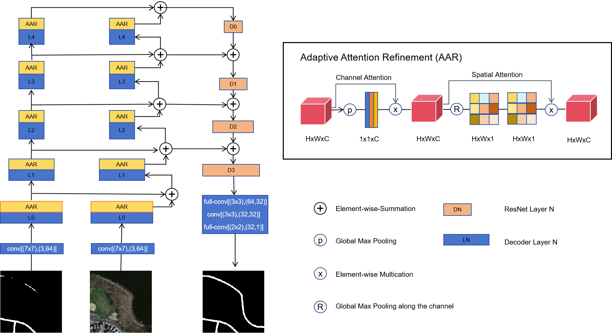
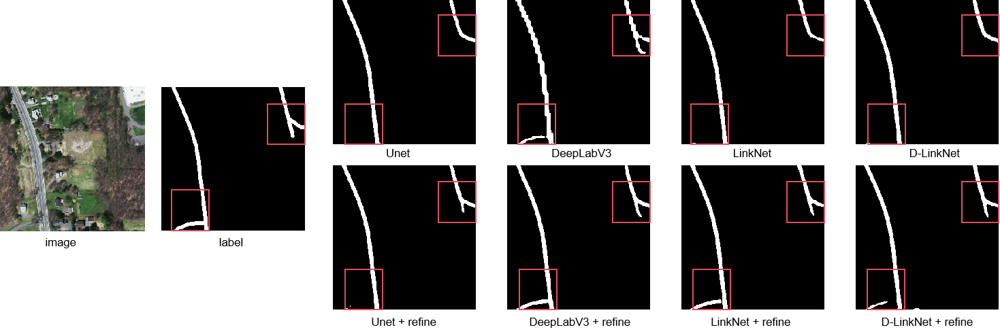
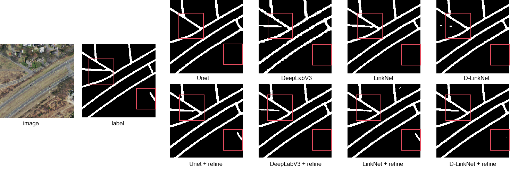
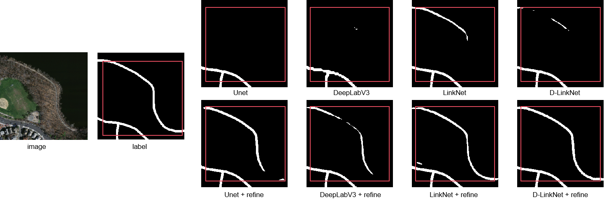
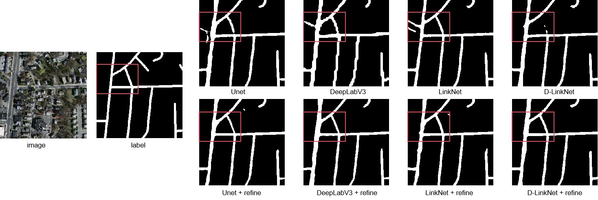

## DRMNet

A Post-Processing Network for Enhancing Road Extraction



## requirements

- [PyTorch](https://pytorch.org/) 
- json
- skimage
- numpy
- tqdm

## Data Preparation

he datasets used in this paper are open-source and can be accessed from the following links: https://www.cs.toronto.edu/~vmnih/data and https://deepglobe.org/.

## Train

```
python train.py
python train_refine.py
```

## Eval

```
python eval.py
```

## results








